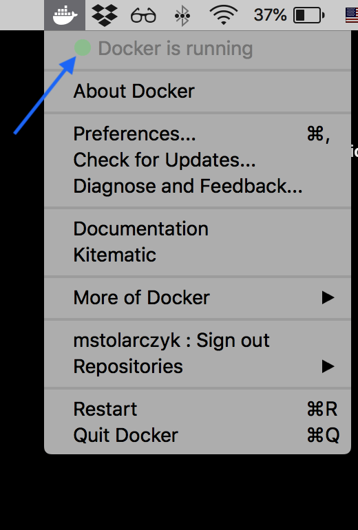
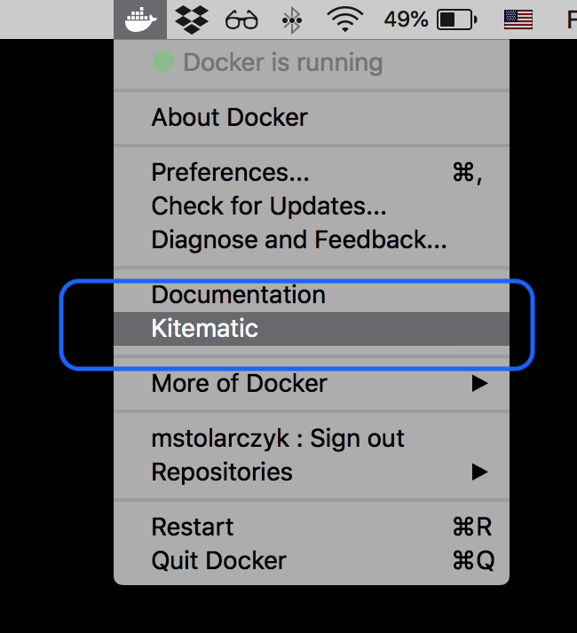
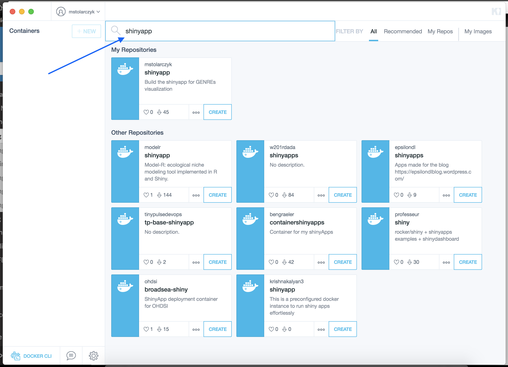

# **Toycon visualization app documentation**

Michal Stolarczyk <mjs5kd@virginia.edu>

# Table of contents
1. [Introduction](#introduction)
    1. [What is this?](#what)
    2. [Functionalities](#Functionalities)
2. [Installation - Docker container](#Installation)

# Introduction<a name="introduction"></a>

## What is this?<a name="what"></a>

The *ToyCon visualization app* is an R shiny app that aids the basic understanding of concepts conveyed in the following publication: *iNRG: A toy network capturing central energy metabolism for use with constraint-based methods.*

## Functionalities<a name="Functionalities"></a>

- **Network layout visualization**, which is intended to graphically present the interconnections between metabolites and reactions in the [genome-scale metabolic reconstruction](https://en.wikipedia.org/wiki/Metabolic_network_modelling#Genome-Scale_Metabolic_Reconstruction). Nodes of the graph represent metabolites and reactions whereas egdes - connections between them. 
- **Network stoichiometry visualization**, which is intended to depict the stoichiometric coefficients in view of the aforesaid network representation of the genome-scale metabolic reconstruction. The width of the edges correspond to the stoichiometic coefficients that determine ratios of each metabolite in the reactions.
- **Reaction knockouts (KOs) impact visualization**, which is intended to present the influence of the specific reaction KOs on genome-scale metabolic reconstruction architecture and fluxes in the model. By means of the [Flux Balance Analysis](https://www.ncbi.nlm.nih.gov/pmc/articles/PMC3108565/pdf/nihms299330.pdf) (FBA) this functionality can be used to detect either essential (when removed render the model carry 0 flux through the [objective function](https://en.wikipedia.org/wiki/Flux_balance_analysis#Objective_function)) or nonessential (when removed do not influence the effective flux value through the objective function) reactions. Additionaly, knockouts can simulate the complete enzyme inhibition that catalyzes the reaction being knocked out.
- **Media changes impact visualization**, which is intended to deptict the incluence of growth media changes on the model growth and fluxes through reactions. The media changes are performed by constraining the exchange reactions in the model during the FBA simulation. For example in order to check the influence of oxygen shortage on the model growth one needs to lower the upper (and lower) flux [bound(s)](https://en.wikipedia.org/wiki/Flux_balance_analysis#Mathematical_description) of the oxygen exchange reaction.
- **Gene expression influence visualization**, which is intended to depict the impact of the pseudo-gene expression changes in the model, which directly influences the flux that is carried by the reaction catalyzed by the enzyme encoded by the gene in question. It is indended to give the user an idea of how the algorithms for gene expression integration influence the fluxes in in the model.

# Installation - Docker container<a name="Installation"></a>
The most reliable, safest and **easiest installation approach** is to use the [Docker](https://www.docker.com/what-docker) platform due to its intrisic characterisitics. In order to do it user needs to run the pre-built Docker image (provided in the official Docker [repository](https://hub.docker.com/r/mstolarczyk/toyconapp/)).

#### 1. Install the Docker CE (community edition) software on your machine

The installation instructions can be found on the [Docker website](https://docs.docker.com/install/):

* Linux
    * [Debian](https://docs.docker.com/install/linux/docker-ce/debian/)
    * [Fedora](https://docs.docker.com/install/linux/docker-ce/fedora/)
    * [Ubuntu](https://docs.docker.com/install/linux/docker-ce/ubuntu/)
* Windows
    * [Windows 10 Pro/Enterprise/Education](https://docs.docker.com/docker-for-windows/install/)
    * [Older Windows](https://docs.docker.com/toolbox/toolbox_install_windows/)
* [MacOS](https://docs.docker.com/docker-for-mac/install/)

#### 2. Open the Docker application to ensure it installed correctly

- On MacOS the green dot and "Docker is running" status should be displayed in the menu after clicking the Docker icon

<br/>
 
<figcaption>**Image 1.** LEFT: MacOS - the dot shows the Docker software status. RIGHT: Windows - ...</figcaption>
<br/>


#### 3. Downloading and launching the application

Generally, running the commands presented in **3.2** will download and launch the application for every operating system. However, in case of MacOS and Windows, there is an option to use a graphical interface to avoid working in terminal, for details see below.

**3.1 Kitematic interface installation (Windows and MacOS only)**

There is a simple, yet powerful graphical user (GUI) interface available for Windows and MacOS - [Kitematic](https://kitematic.com/). Kitematic’s one click install gets Docker running on your computer and lets you control your app containers from a GUI.
Kitematic is provided together with the Docker for Windows and should be ready to use on this stage of installation. 
On MacOS to get Kitematic just expand the Docker menu when it is running, select Kitematic and you will be presented with the instructions on how to install it.

<br/>

<figcaption>**Image 2.** Kitematic can be launched/installed from the Docker manu.</figcaption>
<br/>


_In case of both operating systems_: once the Kitematic is installed, you can search for any Docker image deposited to the Docker Hub. To download the shinyapp, just search the shinyapp phrase and "create" the container deposited by the user: mstolarczyk. 

<br/>

<figcaption>**Image 3.** Any Docker image deposited to the Docker Hub can be downloaded with Kitematic.</figcaption>
<br/>

Once the download process is completed, the container will run automatically and you can launch the application by clicking on the web preview section in Kitematic, as shown below:

<br/>

<figcaption>**Image 4.** The application can be launched by clicking on the web preview in the Kitematic software.</figcaption>
<br/>

**3.2 Command line Docker image management (Linux only)**

Depending on your Docker installation, the superuser privilages may be required, which can be acquired with `sudo`.

Open the command window (terminal) and download the docker image from the repository with a following [command](https://docs.docker.com/engine/reference/commandline/pull):

```docker pull [OPTIONS]```

e.g copy and paste:

``` (sudo) docker pull mstolarczyk/shinyapp:latest ``` (this may take some time depending on your connection)

**3.2.1. Check the image status**:

``` (sudo) docker images```

The output of the command above should resemble the following:

``` 
REPOSITORY              TAG                 IMAGE ID            CREATED             SIZE 
mstolarczyk/toyconapp   latest              45f03ae5cff4        30 minutes ago      2.35GB 
``` 

**3.2.2. Run the application** using the ``` IMAGE ID ``` with a following [command](https://docs.docker.com/engine/reference/commandline/run/):
    
```docker run [OPTIONS] IMAGE [COMMAND] [ARG...] ```

e.g copy and paste

```(sudo) docker run -p 8080:8080 45f03ae5cff4 ``` (note that the ``` IMAGE ID ``` will be different in your case)

The command above will allow you to connect to the application from your web browser.

**3.2.3. Copy and paste this address into your web browser**

``` localhost:8080 ```

