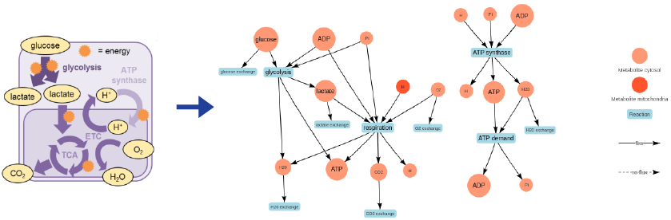

Michal Stolarczyk <mjs5kd@virginia.edu>

## What is this?

*metaboLITE* is an R shiny application that aids the basic understanding of concepts under genome-scale metabolic modeling.
It implements two simple toy models that make it easy to learn the contepts of genome-scale metabolic modeling:

* *iSIM* central energy metabolism
* [*E.coli* core metabolism](http://www.asmscience.org/content/journal/ecosalplus/10.1128/ecosalplus.10.2.1#backarticlefulltext)

## Functionalities

### Visualize the model
- **Network layout visualization**, which is intended to graphically present the interconnections between metabolites and reactions in the <a href="https://www.nature.com/articles/nprot.2009.203.pdf" target="_blank">genome-scale metabolic reconstruction</a> (GENRE) [1]. Nodes of the graph represent metabolites and reactions whereas edges - connections between them. The network is functionally divided into two parts: ATP production and metabolism and glucose metabolism. The main reactions and metabolites are denoted by a bigger font size.
In order to simulate the model growth a <a href="https://www.ncbi.nlm.nih.gov/pmc/articles/PMC3108565/pdf/nihms299330.pdf" target="_blank">Flux Balance Analysis</a> (FBA) simulation is performed [2]. 

- **Network stoichiometry visualization**, which is intended to depict the stoichiometric coefficients in view of the aforesaid network representation of the genome-scale metabolic reconstruction. The width of the edges correspond to the stoichiometic coefficients that determine ratios of each metabolite in the reactions. Additionally, the coefficients are presented in the table on the left. 

### Perform simple experiments with just a click of a button

#### KO reaction tab
- **Reaction knockouts (KOs) impact visualization**, which is intended to present the influence of the specific reaction KOs on genome-scale metabolic reconstruction architecture and fluxes in the model. By means of the FBA this functionality can be used to detect either essential (ones that removed render the model carry 0 flux through the <a href="http://onlinelibrary.wiley.com/doi/10.1002/btpr.1949/epdf" target="_blank">objective function</a>; objective value equals 0) or nonessential (when removed do not influence the effective flux value through the objective function) reactions [3]. Additionally, knockouts can simulate the complete enzyme inhibition that catalyzes the reaction being knocked out.

#### Change media tab
- **Media changes impact visualization**, which is intended to depict the influence of growth media changes on the model growth and fluxes through reactions. The media changes are performed by constraining the exchange reactions in the model during the FBA simulation. For example in order to check the influence of oxygen shortage on the model growth one needs to lower the upper (and lower) flux bound(s) of the oxygen exchange reaction.

#### Simulate gene expression changes tab
- **Gene expression influenece visualization**, which is intended to depict the impact of the pseudo-gene expression changes in the model, which directly influences the flux that is carried by the reaction catalyzed by the enzyme encoded by the gene in question. It is indented to give the user an idea of how the algorithms for gene expression integration influence the fluxes in in the model.

## Model representation
The models are represented as a graph here. The nodes of the graph serve as metabolites and reactions in the form of orange/red circles and blue rectangles, whereas the edges of the graph define the relationship between them.

The converstion of the *iSIM* model is presented in the image below:

## How to cite
TBD

## References
1. Thiele, I. & Palsson, B. Ø. A protocol for generating a high-quality genome-scale metabolic reconstruction. Nature Protocols 5, 93–121 (2010).

2. Orth, J. D., Thiele, I. & Palsson, B. Ø. What is flux balance analysis? Nat Biotechnol 28, 245–248 (2010).

3. García Sánchez, C. E. & Torres Sáez, R. G. Comparison and analysis of objective functions in flux balance analysis. Biotechnol Progress 30, 985–991 (2014).

